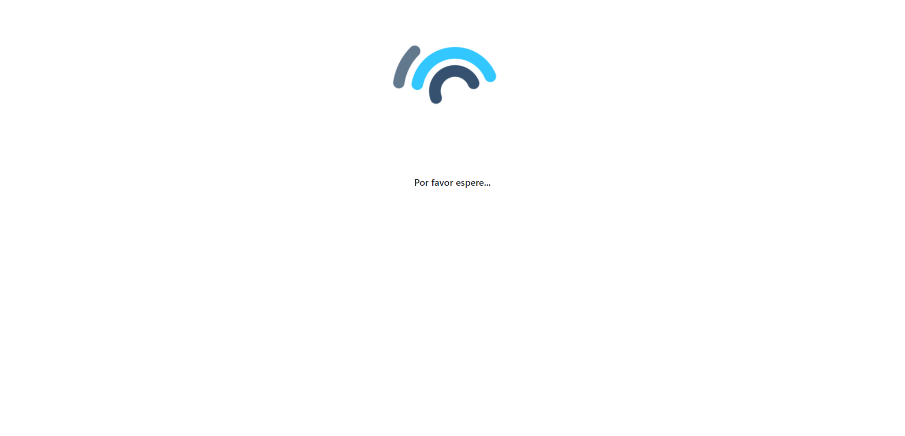

# load-page
Plantilla responsive pantalla de carga con html y css.

## Vista previe



## Recursos necesarios
* la carpeta assets contiene el gif que se muestra en pantalla. Puede reemplazarlo por otro recurso si es necesario.

## HTML 

```html
 <div class="progress">
        <div class="center_progress">
            
            <p>Por favor espere...</p>
        </div>
    </div>
```

## CSS

```css
.progress {
    width     : 100%;
    height    : 100%;
    z-index   : 9999;
    display   : flex;
    background: transparent;
    font-family: 'Kanit', sans-serif;
    font-size: 16px;
    font-weight: 200;

}

.center_progress {
    flex : 0 0 auto;
    width: 100%;
    text-align: center !important;
}

```

## Demo 
Puede visualizar la plantilla [aquí.](https://b3rert.github.io/load-page/)
